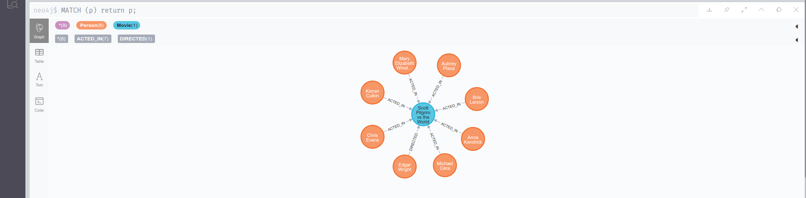
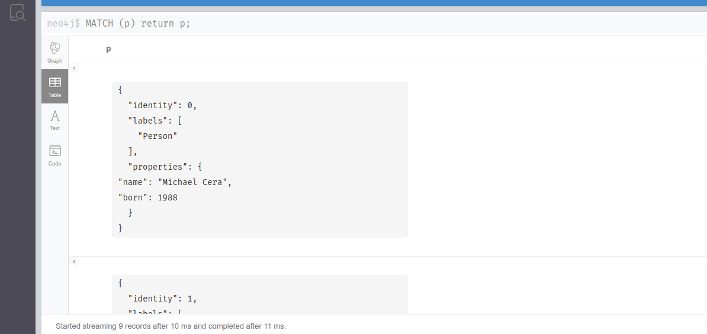

# Neo4j

The command to run `Neo4j` inside of docker:
```sh
# `-dit` is `detach`, `interactive`, and `tty` which actually doesn't
# necessary (why?).

# `--rm` to remove the logs when we're done.

# `-p 7474:74747` is the port at `7474` which is the port of the browser
# interface to neo4j.

# `-p 7687:7687` is the port at `7687` which is actually reading and writing to,
# so our app will be using port `7687`.

# `--env` or `-e` is environment variable to give authentication to neo4j.
# in this case we don't use authentication. unlike postgres, we don't need
# authentication with neo4j.

docker run -dit --rm --name=my-neo4j -p 7474:7474 -p 7687:7687 --env=NEO4J_AUTH=none neo4j:4.1.3

# this command attach docker container running neo4j.

# just like MongoDB uses JSON and javascript, PostgreSQL uses SQL.
# There's a query language for Neo4j and it's called Cypher.
# Cypher is a specific query language made for Neo4j.

docker exec -it my-neo4j cypher-shell
```

## Add Nodes and Relationships

```sql
-- `p` is a variable that represent the node.

-- `:Person` is the label we're gonna put on this particular node.

-- `{ name: "Michael Cera", born: 1988 }` is properties to `Person`
-- node. So, there's two properties there:
-- name: "Michael Cera" and born: 1988.

-- `Person` is the label, and `{ name: "Michael Cera", born: 1988 }`
-- is the properties.

-- don't forget to put the semicolon (;) otherwise neo4j think it's
-- not done yet.

CREATE (p:Person { name: "Michael Cera", born: 1988 });
```

If there's no error, the feedback would be something like this:
```sh
0 rows available after 134 ms, consumed after another 0 ms
Added 1 nodes, Set 2 properties, Added 1 labels
```

If we want to query the `Person` node that we just made, we can do
something like this:
```sql
-- `p` is a variable name that we can use later, we can use `person`
-- instead of `p` too.

-- `RETURN` is to return the result from `p`.

MATCH (p { name: "Michael Cera" }) RETURN p;
```

If there's no error, the result should be something like this:
```sh
+----------------------------------------------+
| p                                            |
+----------------------------------------------+
| (:Person {name: "Michael Cera", born: 1988}) |
+----------------------------------------------+

1 row available after 17 ms, consumed after another 2 ms
```

We can also do something like:
```sql
-- this will going to match every `:Person` label in the database.
-- in this case we only have one node in the database and it happens
-- to be a person.

MATCH (p:Person) RETURN p;
```

If there no error, the feedback should be something like this:
```sh
+----------------------------------------------+
| p                                            |
+----------------------------------------------+
| (:Person {name: "Michael Cera", born: 1988}) |
+----------------------------------------------+

1 row available after 42 ms, consumed after another 2 ms
```

If we just want to get every single node, we do something like this:
```sql
MATCH (p) RETURN p;
```

If there's no error, the feedback should be something like this:
```sh
+----------------------------------------------+
| p                                            |
+----------------------------------------------+
| (:Person {name: "Michael Cera", born: 1988}) |
+----------------------------------------------+

1 row available after 30 ms, consumed after another 1 ms
```

Now, let's create our second node. This node will represent the
movie Scott Pilgrim vs the World:
```sql
-- `m` is a variable that represent the node.

-- `:Movie` is the label we're gonna put on this particular node.

-- `{ title: "Scott Pilgrim vs the World", released: 2010, tagline: "An epic of epic epicness." }` is properties to `Movie`.

-- we can also return what we just created with `RETURN`.

CREATE (m:Movie { title: "Scott Pilgrim vs the World", released: 2010, tagline: "An epic of epic epicness." }) RETURN m;
```

If there's no error, the feedback should be something like this:
```sh
+------------------------------------------------------------------------------------------------------+
| m                                                                                                    |
+------------------------------------------------------------------------------------------------------+
| (:Movie {tagline: "An epic of epic epicness.", title: "Scott Pilgrim vs the World", released: 2010}) |
+------------------------------------------------------------------------------------------------------+

1 row available after 29 ms, consumed after another 18 ms
Added 1 nodes, Set 3 properties, Added 1 labels
```

Now, if we query every single node again like this:
```sql
-- `p` here is not specific to `Person` node, we can name this whatever we want.

MATCH (p) RETURN p;
```

If there's no error, the feedback should be something like this:
```sh
+------------------------------------------------------------------------------------------------------+
| p                                                                                                    |
+------------------------------------------------------------------------------------------------------+
| (:Person {name: "Michael Cera", born: 1988})                                                         |
| (:Movie {tagline: "An epic of epic epicness.", title: "Scott Pilgrim vs the World", released: 2010}) |
+------------------------------------------------------------------------------------------------------+

2 rows available after 2 ms, consumed after another 1 ms
```
as we can see, there's two results now compared to previous result.

Below is the previous results when we only had one node available:
```sh
+----------------------------------------------+
| p                                            |
+----------------------------------------------+
| (:Person {name: "Michael Cera", born: 1988}) |
+----------------------------------------------+

1 row available after 30 ms, consumed after another 1 ms
```

If we can also check the specific `:Movie` label like this:
```sql
-- see? we can name `p` whatever we want, we just need to be
-- consistent when using it.

MATCH (p:Movie) RETURN p;
```

If there's no error, the result should be something like this:
```sh
+------------------------------------------------------------------------------------------------------+
| p                                                                                                    |
+------------------------------------------------------------------------------------------------------+
| (:Movie {tagline: "An epic of epic epicness.", title: "Scott Pilgrim vs the World", released: 2010}) |
+------------------------------------------------------------------------------------------------------+

1 row available after 3 ms, consumed after another 1 ms
```

Now, let's say we want to create a relationship between Scott Pilgrim
and Michael Cera. We want to say that Michael Cera *acted in* Scott
Pilgrim vs the World, and *acted in* is gonna be the relationship or
edge between these two things.

So, the first thing we have to do is, we have to match both of those
nodes (`Person` node and `Movie` node). We can do that something like
this:
```sql
-- `Michael` is a variable that represents Michael Cera.

-- `ScottVsWorld` is a variable that represents Scott vs the World.

-- `relationship` is a variable that represents the relationship between `Michael` and `ScottVsWorld`.

-- `:ACTED_IN` represents the type of relationship between Michael Cera
-- and Scott Pilgrim vs the World.

-- `roles` is a properties for `:ACTED_IN`.

-- `roles` is an array because the person can have multiple roles.

-- `(Michael)-[relationship:ACTED_IN { roles: ["Scott Pilgrim"] }]->(ScottVsWorld)` is the syntax for relationship.
-- if we use human readable format, it would be something like this:
-- "Michael Cera-Acted in-Scott Pilgrim vs the World".
-- it's mean to read like a big arrow like this: (a)-[r]->(b)

MATCH (Michael:Person),(ScottVsWorld:Movie) WHERE Michael.name = 'Michael Cera' AND ScottVsWorld.title = 'Scott Pilgrim vs the World' CREATE (Michael)-[relationship:ACTED_IN { roles: ["Scott Pilgrim"] }]->(ScottVsWorld) RETURN relationship;
```

If there's no error, the output would be something like this:
```sh
+----------------------------------------+
| relationship                           |
+----------------------------------------+
| [:ACTED_IN {roles: ["Scott Pilgrim"]}] |
+----------------------------------------+

1 row available after 227 ms, consumed after another 27 ms
Created 1 relationships, Set 1 properties
```
and as we can see above, we just created one relationship (which is `ACTED_IN`)
and set one properties for the relationship (which is `roles`).

> The neat thing about `cypher` as a query language is that `cypher` actually
> based on ASCII art and they actually explicitly say that they did this so that
> we can kind of read it like a picture.

Now, let's add the rest of Scott Pilgrim vs the World with query from the
[course website](https://btholt.github.io/complete-intro-to-databases/neo4j)
```sql
MATCH (ScottVsWorld:Movie) WHERE ScottVsWorld.title = "Scott Pilgrim vs the World"
CREATE (Anna:Person {name:'Anna Kendrick', born:1985})
CREATE (Brie:Person {name:'Brie Larson', born:1989})
CREATE (Aubrey:Person {name:'Aubrey Plaza', born:1984})
CREATE (Mary:Person {name:'Mary Elizabeth Winstead', born:1984})
CREATE (Kieran:Person {name:'Kieran Culkin', born:1982})
CREATE (Chris:Person {name:'Chris Evans', born:1981})
CREATE (Edgar:Person {name:'Edgar Wright', born:1974})
CREATE
(Anna)-[:ACTED_IN {roles:['Stacey Pilgrim']}]->(ScottVsWorld),
(Brie)-[:ACTED_IN {roles:['Envy Adams']}]->(ScottVsWorld),
(Aubrey)-[:ACTED_IN {roles:['Julie Powers']}]->(ScottVsWorld),
(Mary)-[:ACTED_IN {roles:['Ramona Flowers']}]->(ScottVsWorld),
(Kieran)-[:ACTED_IN {roles:['Wallace Wells']}]->(ScottVsWorld),
(Chris)-[:ACTED_IN {roles:['Lucas Lee']}]->(ScottVsWorld),
(Edgar)-[:DIRECTED]->(ScottVsWorld);
```

If there's no error, the feedback would be something like this:
```sh
0 rows available after 153 ms, consumed after another 0 ms
Added 7 nodes, Created 7 relationships, Set 20 properties, Added 7 labels
```
and as we can see, there's new 7 nodes, 7 relationship, 20 properties, and
7 labels.

## Querying with Match and Constraint

Let's say we want to find Aubrey Plaza, but before that let's check all
the relationship properties like this:
```sql
MATCH (p:Person)-[r:ACTED_IN]->(m:Movie) RETURN r;
```

If there's no error, the result would be something like this:
```sh
+-----------------------------------------+
| r                                       |
+-----------------------------------------+
| [:ACTED_IN {roles: ["Scott Pilgrim"]}]  |
| [:ACTED_IN {roles: ["Stacey Pilgrim"]}] |
| [:ACTED_IN {roles: ["Envy Adams"]}]     |
| [:ACTED_IN {roles: ["Julie Powers"]}]   |
| [:ACTED_IN {roles: ["Ramona Flowers"]}] |
| [:ACTED_IN {roles: ["Wallace Wells"]}]  |
| [:ACTED_IN {roles: ["Lucas Lee"]}]      |
+-----------------------------------------+

7 rows available after 35 ms, consumed after another 3 ms
```

> We can actually query directly for the relationships.

Now, let's query for Aubrey Plaza like this:
```sql
MATCH (p:Person)-[r:ACTED_IN]->(m:Movie) WHERE p.name = 'Aubrey Plaza' RETURN p;
```

If there's no error, the result should be something like this:
```sh
+----------------------------------------------+
| p                                            |
+----------------------------------------------+
| (:Person {name: "Aubrey Plaza", born: 1984}) |
+----------------------------------------------+

1 row available after 44 ms, consumed after another 2 ms
```

Or, we can take take a look at the relationship like this:
```sql
MATCH (p:Person)-[r:ACTED_IN]->(m:Movie) WHERE p.name = 'Aubrey Plaza' RETURN r;
```

If there's no error, the result should be something like this:
```sh
+---------------------------------------+
| r                                     |
+---------------------------------------+
| [:ACTED_IN {roles: ["Julie Powers"]}] |
+---------------------------------------+

1 row available after 38 ms, consumed after another 1 ms
```
as we can see, Aubrey Plaza acted in Scott Pilgrim vs the World as Julie
Powers

Or, we can take a look at the movie like this:
```sql
-- this will give us all the movies Aubrey Plaza acted in, in this case it's only
-- one movie.

MATCH (p:Person)-[r:ACTED_IN]->(m:Movie) WHERE p.name = 'Aubrey Plaza' RETURN m;
```

If there's no error, the result would be something like this:
```sh
+------------------------------------------------------------------------------------------------------+
| m                                                                                                    |
+------------------------------------------------------------------------------------------------------+
| (:Movie {tagline: "An epic of epic epicness.", title: "Scott Pilgrim vs the World", released: 2010}) |
+------------------------------------------------------------------------------------------------------+

1 row available after 66 ms, consumed after another 2 ms
```

Now, what if we want to find everyone that acted in a movie with Aubrey Plaza.
We can do that with something like this:
```sql
-- we don't need to make a variable for the `Movie` because we're gonna
-- search in all the movies that someone acted in with Aubrey Plaza so
-- we don't really need to refer to it.

-- `<>` is how we do "not equal".

-- technically Aubrey Plaza has been in the movies with herself (according to
-- our graph database) so we need to exclude her with something like this:
-- a.name <> 'Aubrey Plaza'.

MATCH (p:Person)-[:ACTED_IN]->(Movie)<-[:ACTED_IN]-(a:Person) WHERE p.name = 'Aubrey Plaza' AND a.name <> 'Aubrey Plaza' RETURN a.name;
```

If there's no error, the result should be something like this:
```sh
+---------------------------+
| a.name                    |
+---------------------------+
| "Chris Evans"             |
| "Kieran Culkin"           |
| "Mary Elizabeth Winstead" |
| "Brie Larson"             |
| "Anna Kendrick"           |
| "Michael Cera"            |
+---------------------------+

6 rows available after 127 ms, consumed after another 5 ms
```
there're 6 people that acted in the same movie as Aubrey Plaza.

Now, what if we want to find the roles these people acted in with Aubrey Plaza?
We can do that with something like this:
```sql
-- basically give a variable in the `:ACTED_IN` relationship on the right.
-- in this case we'll use variable `r`.

MATCH (p:Person)-[:ACTED_IN]->(Movie)<-[r:ACTED_IN]-(a:Person) WHERE p.name = 'Aubrey Plaza' AND a.name <> 'Aubrey Plaza' RETURN r.roles;
```

If there's no error, the result should be something like this:
```sh
+--------------------+
| r.roles            |
+--------------------+
| ["Lucas Lee"]      |
| ["Wallace Wells"]  |
| ["Ramona Flowers"] |
| ["Envy Adams"]     |
| ["Stacey Pilgrim"] |
| ["Scott Pilgrim"]  |
+--------------------+

6 rows available after 76 ms, consumed after another 2 ms
```

We can also return the name of the person and the roles the acted in
with something like this:
```sql
MATCH (p:Person)-[:ACTED_IN]->(Movie)<-[r:ACTED_IN]-(a:Person) WHERE p.name = 'Aubrey Plaza' AND a.name <> 'Aubrey Plaza' RETURN a.name, r.roles;
```

If there's no error, the result should be something like this:
```sh
+------------------------------------------------+
| a.name                    | r.roles            |
+------------------------------------------------+
| "Chris Evans"             | ["Lucas Lee"]      |
| "Kieran Culkin"           | ["Wallace Wells"]  |
| "Mary Elizabeth Winstead" | ["Ramona Flowers"] |
| "Brie Larson"             | ["Envy Adams"]     |
| "Anna Kendrick"           | ["Stacey Pilgrim"] |
| "Michael Cera"            | ["Scott Pilgrim"]  |
+------------------------------------------------+

6 rows available after 1 ms, consumed after another 3 ms
```

Now, what if we want to query for everyone that was younger than Aubrey Plaza
that acted in a movie with her. We can do that with something like this:
```sql
-- basically take a look at `born` attributes for Aubrey Plaza and the people
-- that acted in the same movie as Aubrey Plaza. And then compare them.

MATCH (p:Person)-[:ACTED_IN]->(Movie)<-[:ACTED_IN]-(a:Person) WHERE p.name = 'Aubrey Plaza' AND a.born > p.born RETURN a.name;
```

If there's no error, the result should be something like this:
```sh
+-----------------+
| a.name          |
+-----------------+
| "Brie Larson"   |
| "Anna Kendrick" |
| "Michael Cera"  |
+-----------------+

3 rows available after 97 ms, consumed after another 6 ms
```

Let's say we want to create a constraint where movie names must be unique.

> We all know that there's around 17 Godzilla movies because they keep calling
> the movies Godzilla.

With that in mind, we constraint the movie name with something like this:
```sql
-- this will force the movie title to be unique.

CREATE CONSTRAINT ON (m:Movie) ASSERT m.title IS UNIQUE;
```

If there's no error, the feedback should be something like this:
```sh
0 rows available after 115 ms, consumed after another 0 ms
Added 1 constraints
```

> If we try to create another node with movie label called "Scott Pilgrim vs the World",
> we'll get the following error:<br>
> Node(1) already exists with label `Movie` and property `title` = 'Scott Pilgrim vs the World'

## Neo4j Browser

One of the nice things of Neo4j is that Neo4j kind of provides a nice browser
experience out of the box (directly built-in into Neo4j).

If we open our browser (Incognito FTW) and type `localhost:7474` in the url bar,
we'll see a dashboard for Neo4j Browser.

> If we take a look at our docker command that we run before:<br>
> docker run -dit --rm --name=my-neo4j -p 7474:7474 -p 7687:7687 --env=NEO4J_AUTH=none neo4j:4.1.3
>
> We'll see that we set `7474` as our port, that's for Neo4j Browser (probably).

If we input:
```sql
MATCH (p) return p;
```
in the search bar like below:


That'll give us an interactive results like this:


> We can interact with the results of Neo4j browser.

Or, we can also get a table result like this:


> You can explore the rest, good luck!<br>
> For more info you can visit the [course website](https://btholt.github.io/complete-intro-to-databases/neo4j-browser).
>
> I'll just use the shell. Don't judge me.

## Complex Neo4j Queries

Let's say we want to see all of the labels that i have in the movie database,
we can do something like this:
```sql
-- match all the nodes in our particular database.

-- `DISTINCT` is gonna remove the duplicate.

-- `labels(n)` means grab all the labels from the nodes.

-- `count(*)` means count all the results.

MATCH (n) RETURN DISTINCT labels(n), count(*);
```

If there's no error, the result should be something like this:
```sh
+-----------------------+
| labels(n)  | count(*) |
+-----------------------+
| ["Person"] | 141      |
| ["Movie"]  | 39       |
+-----------------------+

2 rows available after 22 ms, consumed after another 7 ms
```

Now, let's see all the different kind of relationship that we have
(that's sounds weird). We can do something like this:
```sql
-- we're not looking at anything, so we'll leave the last `()` empty

MATCH (n)-[r]->() RETURN type(r), count(*);
```

If there's no error, the result should be something like this:
```sh
+-----------------------+
| type(r)    | count(*) |
+-----------------------+
| "DIRECTED" | 45       |
| "ACTED_IN" | 179      |
| "PRODUCED" | 15       |
| "WROTE"    | 10       |
| "REVIEWED" | 9        |
| "FOLLOWS"  | 3        |
+-----------------------+

6 rows available after 14 ms, consumed after another 7 ms
```

Now, let's just pick an actor and actress and figure out what kind of
things they've acted in with other people. We were looking at Aubrey Plaza
before, now we'll pick Keanu Reeves (do you still need the reason here? why?).
We can do that with something like this:
```sql
-- the command above is basically figurine out the actor or actress that become
-- co-star with Keanu Reeves the most.

MATCH (Keanu:Person)-[:ACTED_IN]->(m:Movie)<-[:ACTED_IN]-(CoStar:Person) WHERE Keanu.name = "Keanu Reeves" RETURN DISTINCT CoStar.name, count(*) ORDER BY count(*) DESC, CoStar.name;
```

If there's no error, the result should be something like this:
```sh
+---------------------------------+
| CoStar.name          | count(*) |
+---------------------------------+
| "Carrie-Anne Moss"   | 3        |
| "Hugo Weaving"       | 3        |
| "Laurence Fishburne" | 3        |
| "Al Pacino"          | 1        |
| "Brooke Langton"     | 1        |
| "Charlize Theron"    | 1        |
| "Diane Keaton"       | 1        |
| "Dina Meyer"         | 1        |
| "Emil Eifrem"        | 1        |
| "Gene Hackman"       | 1        |
| "Ice-T"              | 1        |
| "Jack Nicholson"     | 1        |
| "Orlando Jones"      | 1        |
| "Takeshi Kitano"     | 1        |
+---------------------------------+

14 rows available after 68 ms, consumed after another 4 ms
```

Now, let's say we want to see how far an actor or actress away from
Kevin Bacon. We can do that with `shortestPath` which is doing a *pathfinding*
algorithm on our graph database.

So, we want to find out what's the shortest path between any actor. In this
case, how many degrees away from Kevin Bacon is Keanu Reeves? We can do that
with something like this:
```sql
-- `[*]` means any kind of relationship.

-- if we exclude the `>` in the arraw `->` and just use the `-`, it'll just
-- query to any directional relationship.

MATCH path = shortestPath(
  (Bacon:Person { name: "Kevin Bacon" })-[*]-(Keanu:Person { name: "Keanu Reeves" })
) RETURN path;
```

> The query above will look nice on the browser version instead of the shell
> version, i won't use the browser for now so you can try that out yourself.

We can also use `UNWIND` to make some kind of order in the relationship like
this:
```sql
-- `coalesce` is basically "if the first item exist, i'll return that. if not, return
-- the next item".

MATCH path = shortestPath(
  (Bacon:Person { name: "Kevin Bacon" })-[*]-(Keanu:Person { name: "Keanu Reeves" })
) UNWIND nodes(path) AS node RETURN coalesce(node.name, node.title) AS nameOrTitle;
```

If there's no error, the result should be something like this:
```sh
+--------------------------+
| nameOrTitle              |
+--------------------------+
| "Kevin Bacon"            |
| "A Few Good Men"         |
| "Jack Nicholson"         |
| "Something's Gotta Give" |
| "Keanu Reeves"           |
+--------------------------+

5 rows available after 45 ms, consumed after another 59 ms
```

## Recommendation Algorithm Example

Let's say that someone already seen 45 movies by Halle Berry, they probably
really like Halle Berry (or more like they only know Halle Berry? well
whatever).

We want to query our network for things that Halle Berry has acted in. And then,
we want to jump to recommendations of people that have been in movies with
Halle Berry so they can check out other movies.

So, the way we can do that is something like this:
```sql
-- we want to immediately jump to the person in the same movie(s) as Halle Berry

-- `1..4` in `:ACTED_IN*1..4` is an upper limit at how far this query will
-- explore our graph.

MATCH (Halle:Person)-[:ACTED_IN*1..4]-(Recommendation:Person) WHERE Halle.name = 'Halle Berry' RETURN Recommendation.name, count(*) ORDER BY count(*) DESC, Recommendation.name;
```

If there's no error, the result should be something like this:
```sh
+-------------------------------------+
| Recommendation.name      | count(*) |
+-------------------------------------+
| "Carrie-Anne Moss"       | 3        |
| "Keanu Reeves"           | 3        |
| "Laurence Fishburne"     | 3        |
| "Meg Ryan"               | 3        |
| "Bill Paxton"            | 2        |
| "Gary Sinise"            | 2        |
| "Rosie O'Donnell"        | 2        |
| "Audrey Tautou"          | 1        |
| "Ben Miles"              | 1        |
| "Bill Pullman"           | 1        |
| "Bonnie Hunt"            | 1        |
| "Charlize Theron"        | 1        |
| "Dave Chappelle"         | 1        |
| "David Morse"            | 1        |
| "Ed Harris"              | 1        |
| "Emil Eifrem"            | 1        |
| "Geena Davis"            | 1        |
| "Greg Kinnear"           | 1        |
| "Helen Hunt"             | 1        |
| "Hugo Weaving"           | 1        |
| "Ian McKellen"           | 1        |
| "James Cromwell"         | 1        |
| "Jim Broadbent"          | 1        |
| "John Hurt"              | 1        |
| "Julia Roberts"          | 1        |
| "Kevin Bacon"            | 1        |
| "Liv Tyler"              | 1        |
| "Lori Petty"             | 1        |
| "Madonna"                | 1        |
| "Michael Clarke Duncan"  | 1        |
| "Natalie Portman"        | 1        |
| "Nathan Lane"            | 1        |
| "Parker Posey"           | 1        |
| "Patricia Clarkson"      | 1        |
| "Paul Bettany"           | 1        |
| "Philip Seymour Hoffman" | 1        |
| "Rita Wilson"            | 1        |
| "Sam Rockwell"           | 1        |
| "Stephen Rea"            | 1        |
| "Steve Zahn"             | 1        |
| "Tom Hanks"              | 1        |
| "Victor Garber"          | 1        |
+-------------------------------------+

42 rows available after 24 ms, consumed after another 4 ms
```

> That's a terrible recommendation algorithm, it's just an example
> of how graph database can be used for recommendation.

## Indexes in Neo4j

Let's say we're making an app which tell you who was born in the same year as you.
If we use this query here:
```sql
MATCH (p:Person) WHERE p.born = 1996 RETURN p.name;
```

And if there's no error, the result should be something like this:
```sh
+---------------------+
| p.name              |
+---------------------+
| "Jonathan Lipnicki" |
+---------------------+

1 row available after 2 ms, consumed after another 3 ms
```
as we can see, there's only one actor that was born in 1996 in our database.

The query we did before actually ends up being a fairly expensive query
because it's actually going to go look at every single node in our database
and looking at the year the actor or actress born one by one.

Now, let's try to use `EXPLAIN` like this:
```sql
EXPLAIN MATCH (p:Person) WHERE p.born = 1996 RETURN p.name;
```

If there's no error, the result should be something like this:
```sh
+--------+
| p.name |
+--------+
+--------+

+-------------------------------------------------------------------------+
| Plan      | Statement   | Version      | Planner | Runtime       | Time |
+-------------------------------------------------------------------------+
| "EXPLAIN" | "READ_ONLY" | "CYPHER 4.1" | "COST"  | "INTERPRETED" | 4    |
+-------------------------------------------------------------------------+


+------------------------+---------------------+----------------+
| Operator               | Details             | Estimated Rows |
+------------------------+---------------------+----------------+
| +ProduceResults@neo4j  | `p.name`            |             14 |
| |                      +---------------------+----------------+
| +Projection@neo4j      | p.name AS `p.name`  |             14 |
| |                      +---------------------+----------------+
| +Filter@neo4j          | p.born = $autoint_0 |             14 |
| |                      +---------------------+----------------+
| +NodeByLabelScan@neo4j | p:Person            |            141 |
+------------------------+---------------------+----------------+

0 rows available after 4 ms, consumed after another 0 ms
```
and as we can see in section `NodeByLabelScan`, the `Estimated Rows` is 141.
That's quite a lot of rows.

Now, let's make an index for it. We can do that with something like this:
```sql
CREATE INDEX FOR (p:Person) ON (p.born);
```

If there's no error, the result should be something like this:
```sh
0 rows available after 16 ms, consumed after another 0 ms
Added 1 indexes
```

Now if we run `EXPLAIN` again like this:
```sql
EXPLAIN MATCH (p:Person) WHERE p.born = 1996 RETURN p.name;
```

If there's no error, the result should be something like this:
```sh
+--------+
| p.name |
+--------+
+--------+

+-------------------------------------------------------------------------+
| Plan      | Statement   | Version      | Planner | Runtime       | Time |
+-------------------------------------------------------------------------+
| "EXPLAIN" | "READ_ONLY" | "CYPHER 4.1" | "COST"  | "INTERPRETED" | 36   |
+-------------------------------------------------------------------------+


+-----------------------+----------------------------------------+----------------+------------+
| Operator              | Details                                | Estimated Rows | Ordered by |
+-----------------------+----------------------------------------+----------------+------------+
| +ProduceResults@neo4j | `p.name`                               |              3 | p.born ASC |
| |                     +----------------------------------------+----------------+------------+
| +Projection@neo4j     | p.name AS `p.name`                     |              3 | p.born ASC |
| |                     +----------------------------------------+----------------+------------+
| +NodeIndexSeek@neo4j  | p:Person(born) WHERE born = $autoint_0 |              3 | p.born ASC |
+-----------------------+----------------------------------------+----------------+------------+

0 rows available after 36 ms, consumed after another 0 ms
```
and as we can see, we get `NodeIndexSeek` instead of `NodeByLabelScan` and
the `Estimated Rows` is only 3 instead of 141 which is much better.

## Neo4j Licence

If we can run Neo4j for free if we only running it in one server, but as soon
as you want to do a clustered server (which basically means any sort of like
real production deployment) you have to pay the Neo4j company to run those
particular kinds of things.

The things to keep in mind is that the Community Edition (which basically the
free edition) can only do backups if we take down the server, whereas the
enterprise one can do backups while the server still up.

## Q&A

- Does GraphQL fit with graph database?

> The answer to that, it could. GraphQL was made to query facebook which
> is graph-like in nature. Graph database doesn't necessary fit in GraphQL
> out of the box. We can't just using GraphQL to query against Neo4j but
> we could make that work.

- Do we need to uppercase the `ACTED_IN` in relationship variable?

> No, it's just make it easier to recognize that `ACTED_IN` is the relationship
> variable. Also, the neo4j community and docs recommend doing so.

- Do we need to write the label with the first character uppercase like in
`Person`?

> No, similar to previous question, it's just to make it easier to recognize
> that it's a label.
