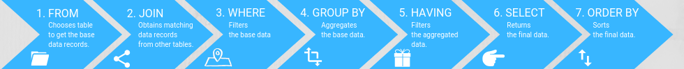

# Frontend Master Intro to Databases

## What is Database?

A database is a piece to store data or a repository of data.
Database meant to be giant scale things that can scale across the entire world that can have,
resiliency and store very important things on it.

## What is Query?

A query is basically just something that you're gonna send to a database,
some action or request or something like that.

## What is Schema

If database is a table in excel spreadsheet, then a schema is the columns.
It's a rigid structure to model data.

We can also say that schema is basically the shape of your data look like.
Let's say we have an object like this:
```json
{ "name": "bruhtus", "city": "surabaya", "state": "indonesia" }
```
the schema of that data would be `name`, `city`, `state`.
So we can have 5 different objects and they would all have the same schema,
they would all have `name`, `city`, and `state` despite the fact that the values of those
would be different but the keys would always be the same.

A spreadsheet is also a database. Of some variety, spreadsheet is  a way of
storing data in a structured fashion.

### Why Schema is Important

Schema is important because some databases like `postgres` are gonna require us
to be very strict about our schema.

For example, we have to tell `postgres` upfront, here's every key that i will
ever give to `postgres` and if we try and give `postgres` another key, it's
gonna be like "i don't know what to do with that" and just fail the entire query altogether.

You can contrast that with `MongoDB`, `MongoDB` be like "give me whatever you want, i dont care".
It's schemaless.

## Types of Databases Covered in This Course

- Relational databases (often called Relational Database Management Systems, RDBMS for short, or SQL databases).
- Document-based databases (often called NoSQL).
- A graph databases.
- A key-value store databases.

## ACID (Atomicity, Consistency, Isolation, and Durability)

- Atomicity is like, does this query happen all at once? It's atomic in nature so you can't divide the query into multiple parts. It is a single query.

> An example is, If i am gonna subtract $10 from my account and add $10 to your account,
> we want that to be one transaction because if that happens in multiple transaction,
> that means what happen if one succeed and then the server goes down?
> Someone lost $10 and someone else didn't gain $10, so that means you lost $10 altogether.
>
> So you need an atomic transaction where the loss of $10 and the gain of $10 is all one atomic transaction.

- Consistency is important for multiple databases.

> If we have multiple database servers running at the same time,
> let's say we have five running databases and one of them suddenly go down,
> the other four need to kind of pick up the slack.
> And if your databases isn't consitent, that means that they're gonna be out of sync a little bit.
> So, you don't actually know which one knows the truth. And even worse, you might actually lose data.
>
> If your main database goes down, and you have four others and they're lagging
> behind the main one, that means you could lose data in the process.

- Isolation, run the query at the same time

> If you have a query that's gonna be doing a bunch of things all at once,
> it's basically means that you can run them concurrently so you can run the transaction broken down into pieces,
> all at the same time or it can run it serially. And everything will happen in the same way.
>
> It's just basically means you can decompose it into parts, running it in different parts and that's still gonna work okay.

- Durability, restore it back to where it was

> If your server crash, you can restore it back to where it was.
> And that's just means it's writing to disk successfully and it means your data is durable to a crash.

**ACID is safe but it's slow**

> For example, something like durability means if your query is durable,
> it means that it's not only writing to the main server but it's actually
> going to be writing out to all of the other servers and they're all going
> to be writing to disk and you have to wait for all that stuff to happen before
> the query is marked as successful.
>
> That's very slow, particularity if your database is spread across the entire world.
> So instead of waiting, five milliseconds, you're now waiting two seconds
> for your query to totally complete.
>
> That might be worth it if you're moving money around, but if you're just,
> let's say uploading a profile picture, it's probably okay if that's not totaly
> consistent and totally durable. There's acceptable loss in data.

**Know the trade off that you're making, know which data is acceptable to lose,
know what data is totally unacceptable to lose.
And you're gonna have to make choices on databases based on that.**

## Transaction

Sometimes one query can't accomplish all the things that you wanna do, so you're
gonna have to send multiple queries to do accomplish the thing that you wanna do,
but again, you can't break it up.

Transaction be like, "i'm gonna send you five queries, but i just don't want you to do anything else beside those five queries".
So it actually make those five queries act as one query. And we're just guaranteeing that either **all happens** or **none of it happens**
because we can't have this partially happen.

**If you have multi-threaded database, you're sending a query that can be broken down into multiple threads.
That query needs to work the same way in parallel it then if it ran sequentially which basically means,
no matter how the database is processing it, the query needs to work the same way.**

**Transaction is how databases get around a problem of "I have a thing that must be atomic, but I don't have the ability to do this in one query".**

> It's like we have to say some idea in one sentence, but we have the grammar structure that doesn't allow us to do it in one sentence,
> therefore we're gonna be using semicolon (`;`) to get this into one sentence.

## NoSQL Database

What NoSQL means is that it's a database that doesn't use SQL.
It just means a non-relational database.

What's we're gonna be talking in this course is a document-based databases
which fulfills the NoSQL paradigm.

One of the biggest advantages to a NoSQL database is that their schemaless,
so you can actually be defining a data schema on the fly.

**The kind of double edge sword here is that you never have to define databases
upfront, you don't have to define collections schema or anything like that, but, if like, for example if you misspell something,
the database be like "Oh you're creating a new field, here you go".
So you have to be very careful about what's going in and out. Also, the more
discipline that you can bring to your data structures, the more queryable it's gonna be later.**

[MongoDB Notes](./mongodb.md)

## SQL Database

What SQL means is relational database, and sometimes abbreviated as RDMS (Relational Database Management System).

It's also important to remember that not all relational databases use SQL, and
not all non-relational databases don't use SQL.

### Relational Database

The best thing to think about relational databases is spreadsheet. Notice that
the name of collection in a relational database is called a table, and that's
not a coincidence.

It's good to think of relational database as rows and columns.

One of the things with a relational database is that it has a defined and very
structure schema.

> Unlike NoSQL database such as MongoDB, we were writing to our collection and
> we just add the owner field on the fly. That's very easy to do in MongoDB, but
> it's not very easy to do in SQL, because SQL is like "you need to tell me
> about all these field before you can give them to me".
>
> If we try to write something that doesn't exist, SQL won't let you.
>
> So we have to issue an entire statement called an **alter table statement**,
> which we don't want to do.
>
> Alter tables are very expensive, it would take down our server to do that.
>
> So we need to be very cautious to not alter our tables very much.

The secret power of relational databases is that they're very good at describing
relations. Whereas with non-relational database like MongoDB, we don't wanna
ever have like, this collection refer to this collection over here. That's not
a good idea.

> With MongoDB, one things we don't wanna do is we don't want to have one
> collection refer to another collection in general.
>
> That's a very expensive thing for you to say, "join these two collections based on this one field".
>
> In general with MongoDB, when you're architecting this type of data, you
> want all the same data to live together and MongoDB provides you with a
> lot of tools to be able to do that.
>
> There's an unspoken rule if you're doing joins in MongoDB, you're doing
> MongoDB incorrectly.

**The core component of SQL is that you wanna have data that relates to each
other, so you're gonna have multiple different tables and those tables are
going to refer to each other.**

SQL stands for Structured Query Language. So if you use this kind of grammar,
you'll be telling the database, how and when to do this kind of queries.



[PostgreSQL Notes](./postgresql.md)

**In general, it's useful to see how we're using our database and figure out
where the expensive queries are. And then create indexes for those queries**.

> Usually you don't want to go too much in advance and prematurely optimizing
> because bad indexes and useless indexes just slow down your computer or your
> searches, and waste a lot of space.

## References

- [Course website](https://btholt.github.io/complete-intro-to-databases/).
- [Docker: Error response from daemon: failed to create endpoint](https://unix.stackexchange.com/questions/360063/docker-error-response-from-daemon-failed-to-create-endpoint-failed-to-add-ho).
- [Available update operators in MongoDB](https://docs.mongodb.com/manual/reference/operator/update/#id1).
- [Aggregation stage in MongoDB](https://docs.mongodb.com/manual/reference/operator/aggregation-pipeline/).
- [The course github repo](https://github.com/btholt/db-samples).
- [Postgres data types](https://www.postgresql.org/docs/9.5/datatype.html#DATATYPE-TABLE).
- [SQL Order of Operations](https://learnsql.com/blog/sql-order-of-operations/).
- [PostgreSQL type of index](https://www.postgresql.org/docs/13.0/indexes.html).
- [PostgreSQL Ops documentation](https://www.postgresql.org/docs/13/admin.html).
